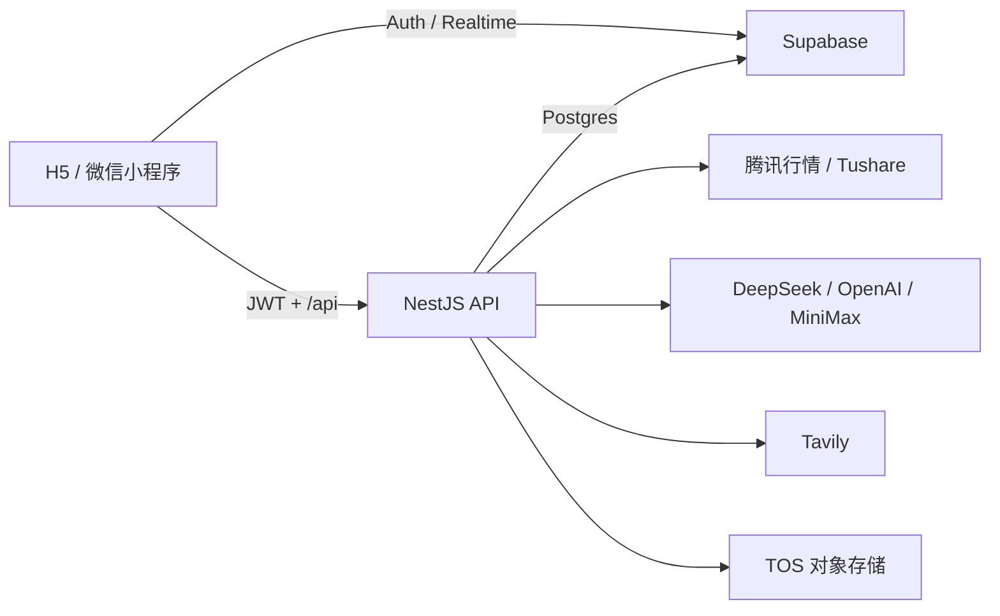

# Stock Notes · 投研笔记

面向 A 股个人研究流程的投研笔记与 AI Agent。项目把自选股、持仓纪律、研究笔记、每日简评和多模型对话放在同一套数据与权限体系中，支持 H5 和微信小程序。

> 项目不会替用户做投资判断。AI 输出仅用于整理信息、复盘观点和辅助研究，不构成投资建议。

## 核心能力

- **股票研究工作台**：搜索并添加沪深北普通 A 股，管理自选与持仓状态，展示价格时间和涨跌信息。
- **交易纪律**：记录买入理由、入场价和止损比例；买入、卖出与对应笔记在同一数据库事务中完成。
- **观点与笔记**：支持普通笔记、文档笔记、Markdown 渲染、永久高亮、编辑后锚点重定位和观点筛选。
- **每日简评**：结合行情、历史价格和已有笔记生成单段简评及红黄绿信号，并通过 Supabase Realtime 同步。
- **股票研究 Agent**：围绕单只股票连续对话，可读取股票资料、价格历史、笔记和每日简评，支持 DeepSeek、OpenAI、MiniMax 与 Tavily 联网检索。
- **跨端运行**：同一套 Taro 前端支持 H5、微信小程序及现有非 Docker 抖音构建；NestJS 提供统一 `/api`。

图片上传与视觉模型协议已经具备，但需要额外配置 TOS 和视觉模型凭据；跨观点 AI 报告等仍在后续迭代中，实际进度以 [Roadmap](docs/ROADMAP.md) 为准。

## 技术架构



| 层级 | 技术 |
| --- | --- |
| 前端 | Taro 4、React 18、TypeScript、Tailwind CSS 4、Zustand、Taro shadcn/ui |
| 后端 | NestJS 10、Node.js、Zod、Drizzle ORM、`pg` |
| 数据与认证 | Supabase Auth、Postgres、RLS、Realtime |
| 外部能力 | 腾讯行情、Tushare、DeepSeek、OpenAI、MiniMax、Tavily、TOS |
| 工程化 | pnpm、Vite、Docker Compose、Nginx |

## 快速开始

### 环境要求

- Node.js 22（推荐）
- pnpm 9+
- 可访问的 Supabase 项目
- Docker Desktop / Docker Compose v2（仅 Docker 工作流需要）

项目只使用 pnpm，禁止使用 npm 或 yarn 安装依赖。

### 最低环境变量

```bash
cp .env.example .env.local
```

本地启动的基础配置如下：

```dotenv
SUPABASE_URL=
SUPABASE_ANON_KEY=
SUPABASE_SERVICE_ROLE_KEY=

# 数据库凭据二选一，推荐使用密码 + 默认 pooler profile
SUPABASE_DB_PASSWORD=
# 或：SUPABASE_DB_URL=
```

Tushare、模型、Tavily、TOS、邮件告警和测试账号均为按功能启用项，完整说明见 [.env.example](.env.example)。首次使用前还需按 [Supabase 接入指南](docs/SUPABASE.md) 应用数据库迁移与 RLS。

### 安装与启动

```bash
pnpm install
pnpm dev
```

- H5：http://localhost:5001
- API 健康检查：http://localhost:3000/api/health

单独启动某一端：

```bash
pnpm dev:web
pnpm dev:server
pnpm dev:weapp
```

## Docker 运行

### 开发环境

使用 `.env.local` 启动带热更新的 H5 与 NestJS：

```bash
pnpm docker:dev
pnpm docker:dev:down
```

### 生产环境

```bash
cp .env.production.example .env.production
# 填写真实生产配置后：
pnpm docker:prod:build
pnpm docker:prod
```

生产环境只暴露 Nginx 单一入口，H5 与 `/api` 使用同一域名；NestJS 不直接发布宿主机端口。

```bash
pnpm docker:prod:down
```

### 微信小程序

在 `.env.production` 中配置平台登记的 HTTPS `PROJECT_DOMAIN` 后执行：

```bash
pnpm docker:build:weapp
```

产物写入 `dist/`。抖音 Docker 支持已取消；现有非 Docker 构建仍可使用 `pnpm build:tt`。

完整部署、日志、健康检查和故障排查见 [Docker 运行指南](docs/DOCKER.md)。

## 构建与测试

常用构建命令：

```bash
pnpm build          # lint + 类型检查 + H5 + 微信 + 抖音 + 后端
pnpm build:web
pnpm build:weapp
pnpm build:server
```

主要质量门禁：

```bash
pnpm validate             # ESLint + TypeScript
pnpm test:prelaunch       # 上线前核心契约
pnpm test:agent:all       # 股票研究 Agent 全批次
pnpm test:note-highlights # Markdown 高亮与锚点
pnpm test:docker          # Docker 静态与运行契约
```

数据库集成测试需要有效的 Supabase 数据库凭据：

```bash
pnpm test:daily-brief
pnpm test:price-history
pnpm test:trade
```

## 项目结构

```text
├── src/                         # Taro / React 前端
│   ├── pages/                   # 首页、观点库、股票、笔记、Agent 等页面
│   ├── components/ui/           # Taro shadcn/ui 组件
│   ├── agent/                   # Agent 前端状态与 API
│   └── network.ts               # 跨端网络请求封装
├── server/                      # NestJS 后端
│   ├── migrations/              # PostgreSQL / Supabase 迁移
│   └── src/
│       ├── agent/               # Provider、工具、队列与运行时
│       ├── notes/               # 笔记与永久高亮
│       ├── stocks/              # 股票、交易与价格历史
│       ├── ai/                  # 每日简评与图片分析
│       └── storage/              # 数据库与鉴权基础设施
├── config/                      # Taro 多端构建配置
├── docker/                      # Nginx 与 Docker 契约
├── docs/                        # 架构、运行和产品文档
├── Dockerfile
├── docker-compose.dev.yml
├── docker-compose.yml
└── docker-compose.tools.yml
```

## 开发约束

- **依赖管理**：只使用 pnpm，并提交 `pnpm-lock.yaml`。
- **UI**：通用组件优先复用 `@/components/ui/*`，不要在业务页面重复手搓按钮、输入框、卡片或弹窗。
- **样式**：优先使用 Tailwind 预设类，避免业务代码硬编码 `px`。
- **网络请求**：业务代码统一使用 `Network`，API 地址保持 `/api/...` 相对路径；不要直接调用 `Taro.request` 或硬编码域名。
- **静态资源**：除微信 TabBar 图标外，图片和视频使用 TOS URL，不把大资源打进小程序包。
- **服务端路由**：NestJS 已设置全局 `/api` 前缀，Controller 装饰器中不要重复写 `api`。

完整开发规范见 [AGENTS.md](AGENTS.md)。

## 进一步阅读

- [Docker 运行与部署](docs/DOCKER.md)
- [Supabase 接入、迁移与 RLS](docs/SUPABASE.md)
- [股票与持仓状态机](docs/STATE_MACHINE.md)
- [产品 Roadmap](docs/ROADMAP.md)
- [股票研究 Agent 发布说明](docs/superpowers/AGENT_RELEASE_NOTES_2026-06-19.md)
